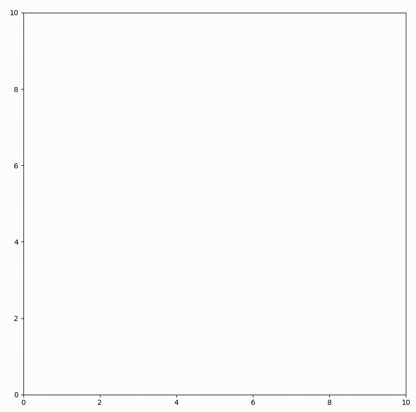

# GenerateCurveTool

A tool of generating the common curves from way points for the robot path planning, including dubins path, reeds shepp, etc.


Dubins path  |   Reeds Shepp    |
:-------------------------:|:-------------------------:|
  |  

## Prerequisite

- Python: >= 3.8
    - numpy  
    - matplotlib 

## Installation


You can simply install the package by pip:

```
pip install gctl
```

or install the development version by following command:

```
git clone https://github.com/hanruihua/GenerateCurveTool  
cd GenerateCurveTool  
pip install -e . 
```

## Usage 

The examples are in [GenerateCurveTool/example/](https://github.com/hanruihua/GenerateCurveTool/tree/main/example)

## Roadmap

- [x] Direct line
- [x] Dubins path
- [x] Reeds shepp
- [ ] bezier 

## Author

Han Ruihua  
Contact: hanrh@connect.hku.hk

